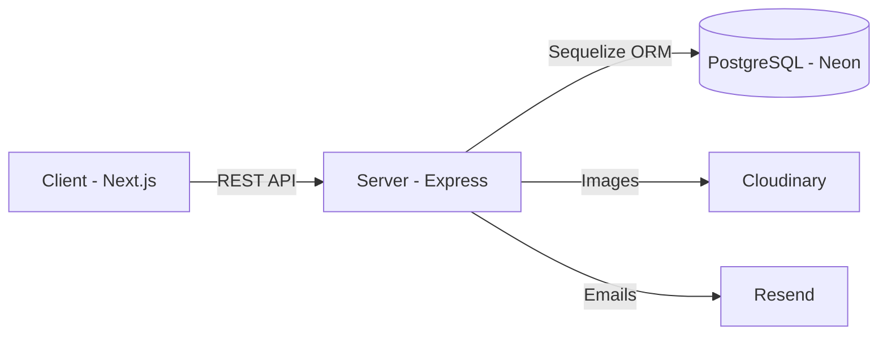
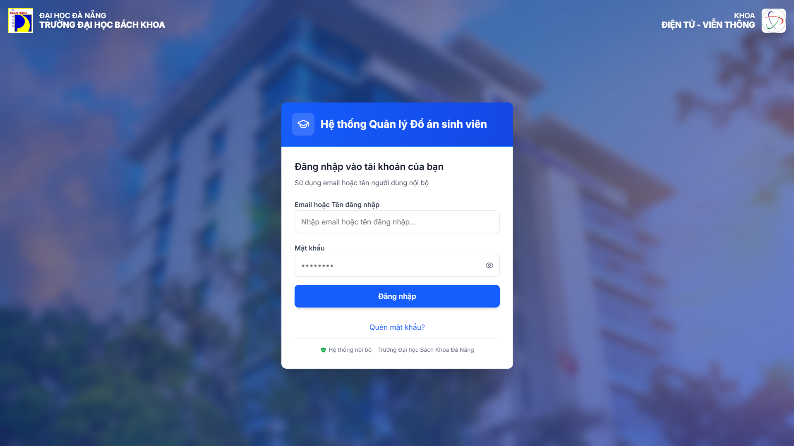
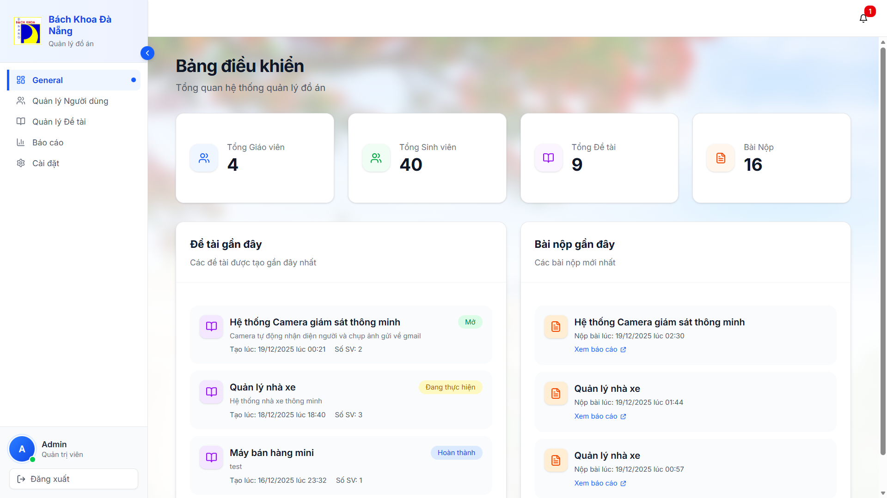
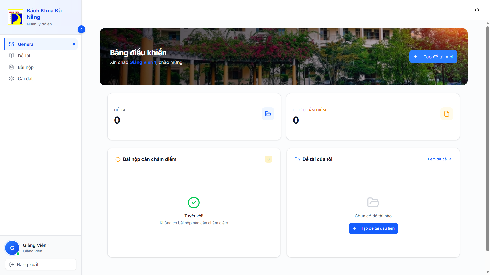
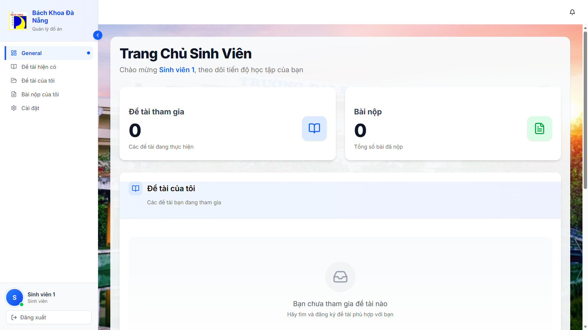

# CNPM Project Management System

<div align="center">


</div>

A full-stack **Student Project Management System** developed as part of the **Software Engineering (CNPM)** course.
This system provides a complete workflow for **managing academic projects**, including authentication, role-based access control, project lifecycle management, student enrollment, grading, logging, and production-ready deployment.

The project is designed to closely resemble a **real-world software system**, applying modern web technologies and best practices in software engineering.

---

## 📚 Documentation

- **[📖 BÁO CÁO DỰ ÁN (Tiếng Việt)](BÁO%20CÁO%20DỰ%20ÁN.md)** - Báo cáo chi tiết về hệ thống, kiến trúc, và thiết kế
- **[🔧 ERROR_HANDLING_FIX](ERROR_HANDLING_FIX.md)** - Tài liệu cải thiện xử lý lỗi và debugging

---

### ⚡ Why These Technologies?

- **Next.js 14**: Server-side rendering, App Router, optimal performance
- **PostgreSQL**: Robust relational database with ACID compliance
- **Sequelize**: Type-safe ORM with migrations support
- **Cloudinary**: Reliable CDN for image storage
- **JWT**: Stateless authentication suitable for REST APIs

---

## 📑 Table of Contents

1. [Overview](#1-overview)
2. [Objectives](#2-objectives)
3. [System Roles & Permissions](#3-system-roles--permissions)
4. [Key Features](#4-key-features)
5. [Technology Stack](#5-technology-stack)
6. [System Architecture](#6-system-architecture)
7. [Database Design](#7-database-design)
8. [API Design](#8-api-design-examples)
9. [Project Structure](#9-project-structure)
10. [Environment Configuration](#10-environment-configuration)
11. [Installation & Local Development](#11-installation--local-development)
12. [Deployment](#12-deployment)
13. [Security Considerations](#13-security-considerations)
14. [Performance & Optimization](#14-performance--optimization)
15. [Limitations](#15-limitations)
16. [Future Improvements](#16-future-improvements)
17. [Contributing](#17-contributing)
18. [Screenshots](#screenshots)
19. [Author](#author)
20. [License](#license)

---

## 1. Overview

The **CNPM Project Management System** is a web-based platform that helps universities and instructors manage **student projects** efficiently.

The system addresses common academic problems:

- Students accidentally joining multiple projects
- Teachers lacking visibility into enrollment status
- Manual grading and project tracking
- Insecure authentication and password recovery workflows

This application follows a **client-server architecture** with a modern frontend and a scalable backend.

---

## 2. Objectives

- Apply **Software Engineering principles** learned in the CNPM course
- Design a **modular, maintainable, and scalable system**
- Implement **secure authentication and authorization**
- Practice **frontend-backend separation**
- Use **ORM-based relational database modeling**
- Deploy a real application to **cloud platforms**

---

## 3. System Roles & Permissions

### Admin

- Create, update, and delete users
- Assign user roles (admin / teacher / student)
- View system logs
- Monitor platform activity

### Teacher

- Create, update, and delete projects
- Set project expiration dates
- Define maximum number of students per project
- View students enrolled in each project
- Grade students

### Student

- View available projects
- Join **only one project**
- View joined project details
- View assigned grades

---

## 4. Key Features

### 🔐 Authentication & Authorization

- JWT-based authentication
- Secure login and logout
- Role-based route protection
- Middleware-based permission validation

### 🔑 Password Reset Workflow

- Forgot password via email
- Secure reset token (hashed before storage)
- Token expiration enforcement
- Email delivery using **Resend**

### 📋 Project Management

- Create, edit, and delete projects
- Project expiration enforcement
- Maximum student limit validation
- Backend-level business rule enforcement

### 👥 Student Enrollment

- Each student can join **only one project**
- Validation prevents duplicate or invalid enrollment
- Clear error responses for frontend handling

### 📊 Grading System

- Teacher assigns numeric grades (0–10)
- Frontend visual indicators for grades
- Secure grade update permissions

### 📸 Avatar Upload

- Image upload and update via **Cloudinary**
- Multer middleware integration
- Automatic overwrite on avatar update
- Secure public URLs

### 📝 Logging System

- System activity logging
- Logs stored in database
- Paginated log retrieval for performance

---

## 5. Technology Stack

### Frontend

- **Next.js 14 (App Router)**
- **TypeScript**
- **Tailwind CSS**
- **shadcn/ui**
- **Lucide Icons**
- **React Hook Form**

### Backend

- **Node.js**
- **Express.js**
- **TypeScript**
- **Sequelize ORM**
- **PostgreSQL**

### Infrastructure & Services

- **Neon** – PostgreSQL cloud database
- **Cloudinary** – Image storage
- **Resend** – Email service
- **Vercel** – Frontend deployment
- **Render** – Backend deployment

---

## 6. System Architecture



- Frontend communicates with backend via REST APIs
- Backend handles authentication, authorization, and business logic
- Sequelize manages database models and relationships
- External services handle email and image storage

---

## 7. Database Design

### Main Tables

- `users`
- `projects`
- `project_students`
- `grades`
- `password_reset_tokens`
- `logs`

### Relationships

- One **teacher** → many **projects**
- One **project** → many **students**
- One **student** → one **project**
- One **user** → many **logs**

Foreign key constraints and validations ensure data integrity.

---

## 8. API Design (Examples)

### Authentication

- `POST /api/auth/login`
- `POST /api/auth/register`
- `POST /api/auth/forgot-password`
- `POST /api/auth/reset-password`

### Projects

- `GET /api/projects`
- `POST /api/projects`
- `PUT /api/projects/:id`
- `POST /api/projects/:id/join`

### Users

- `GET /api/users`
- `PUT /api/users/:id`
- `DELETE /api/users/:id`

### Logs

- `GET /api/logs?page=1&limit=10`

---

## 9. Project Structure

```
CNPM-Project-Management
├── client/                     # Frontend (Next.js)
│   ├── app/
│   ├── components/
│   ├── hooks/
│   ├── lib/
│   └── styles/
│
├── server/                     # Backend (Express)
│   ├── controllers/
│   ├── models/
│   ├── routes/
│   ├── middlewares/
│   ├── utils/
│   └── config/
│
└── README.md
```

---

## 10. Environment Configuration

### Backend (`server/.env`)

```env
PORT=5000
DATABASE_URL=postgresql://...

JWT_SECRET=your_secret_key

CLOUDINARY_CLOUD_NAME="your cloudinary cloud name"
CLOUDINARY_API_KEY="your API Cloudinary key"
CLOUDINARY_API_SECRET="your API secret"

RESEND_API_KEY="your Resend API key"
EMAIL_FROM=no-reply@yourdomain.com
FRONTEND_URL=http://localhost:3000
```

### Frontend (`client/.env.local`)

```env
NEXT_PUBLIC_API_URL=http://localhost:5000/api
NEXT_PUBLIC_CLOUDINARY_CLOUD_NAME="your public cloudinary name"
```

---

## 11. Installation & Local Development

### 📥 Clone the repository

```bash
git clone https://github.com/dangbach204/CNPM-Project-Management.git
cd CNPM-Project-Management
```

### ⚙️ Backend Setup

```bash
cd be
npm install
# Or if you encounter dependency issues:
npm install --force
npm run dev
```

### 🎨 Frontend Setup

```bash
cd fe
npm install
# Or if you encounter dependency issues:
npm install --force
npm run dev
```

### 🌐 Access the Application

- **Frontend:** http://localhost:3000
- **Backend API:** http://localhost:5000

---

## 12. Deployment

- **Frontend** deployed on **Vercel:** https://cnpm-project-management.vercel.app/
- **Backend** deployed on **Render**
- **Database** hosted on **Neon PostgreSQL**

Environment variables are configured separately for production.

---

## 13. Security Considerations

- Password hashing using bcrypt
- JWT-based authentication
- Hashed password reset tokens
- Token expiration enforcement
- Role-based access control
- Input validation and sanitization

---

## 14. Performance & Optimization

- Pagination for large datasets
- Optimized database queries
- Lazy loading on frontend
- Indexed frequently queried fields

---

## 15. Limitations

- No real-time notifications
- No file submission system
- No project version history

---

## 16. Future Improvements

- Real-time notifications (WebSocket)
- Project discussion/chat system
- File submission and review
- Admin analytics dashboard
- Docker-based deployment

---

## 17. Contributing

This project is for educational purposes, but contributions are welcome!

1. Fork the repository
2. Create a feature branch (`git checkout -b feature/AmazingFeature`)
3. Commit changes (`git commit -m 'Add AmazingFeature'`)
4. Push to branch (`git push origin feature/AmazingFeature`)
5. Open a Pull Request

---

## Screenshots

### Login page



### Admin dashboard



### Teacher dashboard



### Student dashboard



---

## Author

**Dang Bach**  
GitHub: https://github.com/dangbach204

---

## License

This project is developed for **educational purposes (CNPM course)**.
Free to use and modify for learning and academic use.

---

## 📖 Related Documentation

For more detailed information, please refer to:

- **[BÁO CÁO DỰ ÁN (Tiếng Việt)](BÁO%20CÁO%20DỰ%20ÁN.md)** - Comprehensive technical report including:

  - Detailed system requirements
  - Complete API documentation
  - Database schema with ERD
  - UI/UX design specifications
  - Testing and deployment guides

- **[ERROR_HANDLING_FIX](ERROR_HANDLING_FIX.md)** - Error handling improvements:
  - Error utility modules
  - Debugging guidelines
  - Best practices for error handling
  - Testing scenarios

---

<div align="center">

**⭐ If you find this project helpful, please consider giving it a star!**

Made with ❤️ for CNPM Course

</div>
